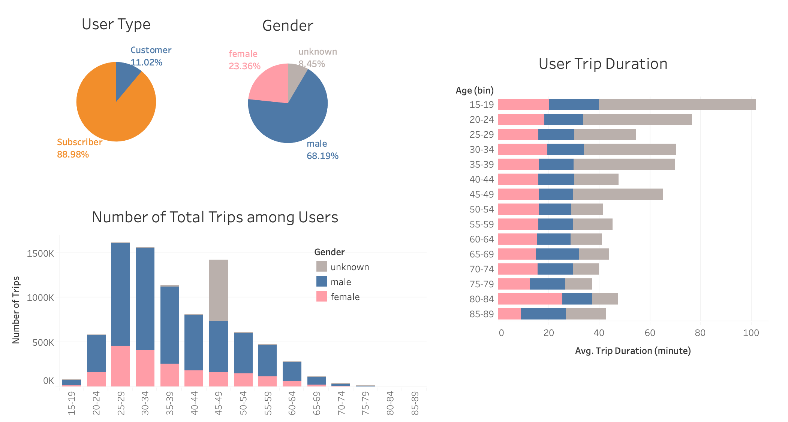
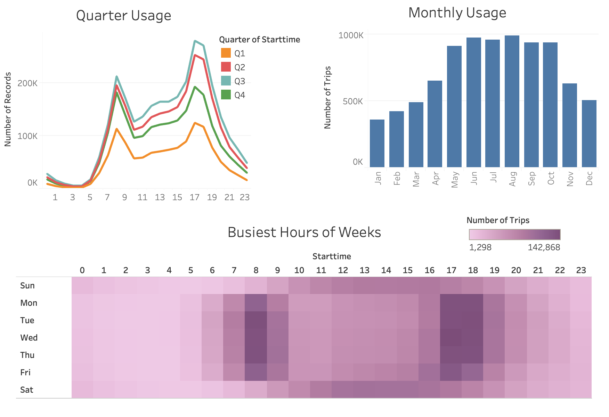

# New York Citi Bike Analytics

## Background

[New York Citi Bike](https://en.wikipedia.org/wiki/Citi_Bike) Program is the largest bike sharing program in the United States. Since 2013, the Citi Bike Program has implemented a robust infrastructure for collecting data on the program's utilization. Through the team's efforts, each month bike data is collected, organized, and made public on the [Citi Bike Data](https://www.citibikenyc.com/system-data) webpage.

However, while the data has been regularly updated, the team has yet to implement a dashboard or sophisticated reporting process. City officials have a number of questions on the program, so the task is to build a set of data reports to provide the answers and provide business insights for improving the city program. 

## Task

**Aggregate the data found in the Citi Bike Trip History Logs to build a data dashboard or story.**

  <a href="#data-source-and-preparation">Data Source and Preparation</a> •
  <a href="#findings">Findings</a> •
  <a href="#technology-Used">Technology Used</a>

## Findings

**Click [here](https://public.tableau.com/profile/lei6868#!/vizhome/citibike_2018_half/Story1) to view complted tableau dashboard**

By analyzing trip histories data in New York city in 2018, I found the followings: 

* **User Analysis**

By analyzing half of 2018 trip records (8,766,192 records), we found most users are subscribers (89%), only 11% are customers. Male users are dominant users, accouting for 68% of all the total trips. Females users account for 23%. There are also 8% users did not release their gender information. In the future, promotions targeting female users may help increase the overall profit. Across different ages, we found users at age 25-29 rode most, followed by age 30-34 years old. 

* **Busiest Time Analysis** 

As expected, May to October have higher number of trips than the rest of the year, possibly due to the weather condition. Across different seasons, we found similar busiest hour patterns, with 17pm being the highest trip starting time and 8am being the 2nd highest trip starting time. This suggests people were biking to and from work. We also noticed different trends between weekdays and weekends. 

* **Bike Station Analysis** 

We found the top stations are around Pershing Square North. 

* **Unexpected Phenomena** 
For the number of trips among different ages and genders, there is a supprisingly high usage among 45-49 year range. By looking into it, those are mainly from age 49 and unknown gender riders. 

## Limitations
We randomly picked half of the records from 2018 due to the up limit of Tableau (15 million rows). It would not impact the trend of the analysis. But there might be slight difference between this analysis and analysis of the whole dataset.

## Data Source and Preparation

**Data Source**
This [Citi Bike Data](https://www.citibikenyc.com/system-data) has been processed to remove trips that are taken by staff as they service and inspect the system and any trips that were below 60 seconds in length 
(potentially false starts or users trying to re-dock a bike to ensure it's secure). The analysis was performed using New York [Citi Bike Trip Histories Data](https://s3.amazonaws.com/tripdata/index.html) for year 2018 (monthly csv files 201801-citibike-tripdata.csv.zip to 201812-citibike-tripdata.csv.zip).

**Data Preaparation (half data)**
The whole 2018 trip history dataset is a very large dataset with more than 15 million rows, which exceeds the up limit that Tableau can handle. We end up randomly cutting half the records for better performance.
* Combine the monthly csv files to one csv file using python in Jupyter notebook.
* Clean the data: drop NA, remove age>90, reduce file size by keeping every other row after sorting by trip start time.
* Transform the birth year and trip duration data to age and trip duration in minutes.
* Export it as a csv files for Tableau analysis.

## Technology Used
**Python** •
**Tableau** 

